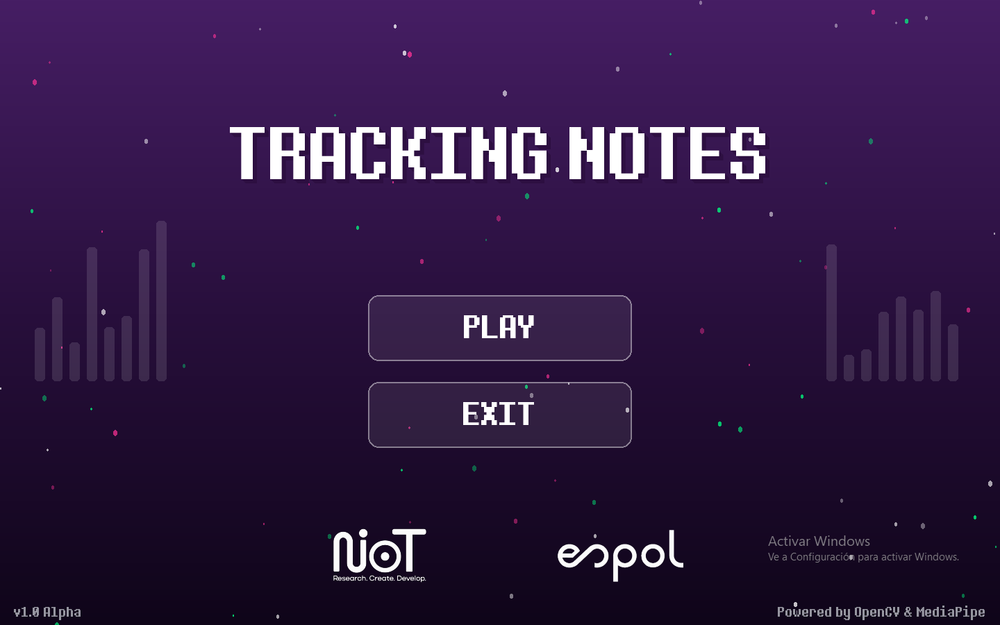
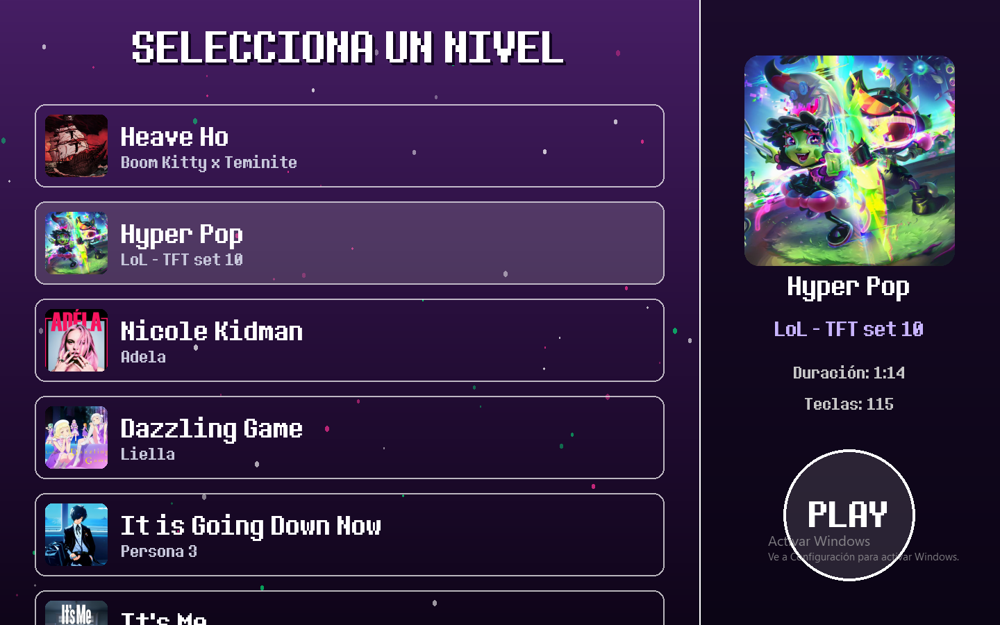
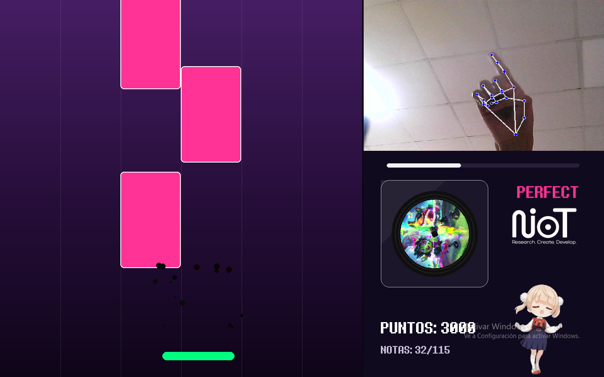

<h1 align="center">Tracking Notes</h1>

---

<p align="center">
  <em>Juego de Ritmo Interactivo controlado por Visión Computacional</em>
</p>

<p align="center">
  
  
  
  
</p>

<br>

**Tracking Notes** es un juego de ritmo interactivo y moderno controlado completamente por movimiento. En lugar de usar periféricos tradicionales, el jugador utiliza sus manos en el aire para controlar un recolector en pantalla, atrapando notas musicales que caen al compás de la música.

## ⚙️ Características del Código

El proyecto fue construido priorizando la separación de responsabilidades limpia, basándose en tres pilares tecnológicos principales:

* **PyGame:** Gestiona los dibujos en pantalla, reproducción de efectos de sonido y detector de colisiones.
* **OpenCV:** Utilizado para interactuar directamente con la cámara del dispositivo de manera asíncrona. 
* **MediaPipe:** Procesa los fotogramas capturados por OpenCV para realizar un *tracking* de la mano en tiempo real. 

## 📁 Estructura del Proyecto

El repositorio está organizado de la siguiente manera para facilitar el mantenimiento y la escalabilidad de nuevos niveles:

```text
Tracking_Notes/
│
├── main.py               # Bucle principal que conecta menús, selector y juego
├── config.py             # Constantes, paleta de colores, físicas y variables UI
├── game.py               # Motor del juego, físicas de notas y sistema de hit
├── menu.py               # Menú de inicio interactivo con partículas
├── level_selector.py     # Interfaz de selección de niveles y previsualización
├── recorder.py           # Script para crear y mapear niveles nuevos
├── tracker.py            # Motor de visión computacional y lectura de cámara
├── gif_loader.py         # Descodificador para animaciones GIF fluidas
│
└── assets/               # Recursos multimedia
    ├── font/             # Tipografías personalizadas (pixel.ttf)
    ├── img/              # Carátulas de canciones, logos y animaciones GIF
    ├── levels/           # Archivos JSON con los mapas de notas y metadatos
    └── music/            # Pistas de audio y efectos de sonido (.wav)
```

## 📸 Imágenes del juego

<div align="center">
  
  <br> <br>
  
  <br> <br>
  
  <br> <br>
  
</div>
